<p align="center">

</p>

# Fifa Ultimate Team Card Creator Twitter bot


[](https://twitter.com/futcardcreator)

A Twitter bot written in Python which uses the Tweepy library

The bot creates a Fifa Ultimate Team card when Twitter users make a request

Request Tweets must be in a [specific format](#how-to-tweet-at-the-bot)

Users can chose from a selection of cards, country flags and club badges which are listed in the [resources](#resources) section

<br/>
<br/>
<br/>

<p align="center">

</p>

## Contents

- [How to tweet at the bot](#how-to-tweet-at-the-bot)
- [Example usages](#example-usages)
  - [Examples with other languages](#examples-with-other-languages)
- [Language Support](#language-support)
  - [Position conversion](#position-conversion)
- [Resources](#resources)
  - [FUT Cards](#fut-cards)
  - [Country Flags](#country-flags)
  - [Club Badges](#club-badges)
  
  
## How to tweet at the bot
In order to get the bot to generate a FUT card you must 'mention' the bot in a tweet e.g. `@futcardcreator` and the parameters must be in a specific format:
```
[Name, Position, Club Number, Country Code, Overall, PAC, DRI, SHO, DEF, PAS, PHY, Card Code, Language Code]
```

- The values for PAC, DRI, SHO, DEF, PAS and PHY must be between 0 and 99 (inclusive)
- Club number, country code and card code must be among the resources supported ([resources section](#resources))
- Language code is optional and must be one of the languages supported ([supported languages](#language-support))
  - If no language code is specified then English is used as the default
- The position must be among the valid positions within the language code ([valid positions for each language](#positions-for-each-language))


## Example Usages
The following tweet

```
@futcardcreator [Messi,RW,241,AR,94,88,96,91,32,88,61,RARE_GOLD]
```
(along with an image of Messi attached to the tweet) will generate the card shown on the right

It is valid to add (or omit) a space after each comma between the square brackets in the request tweet e.g:
```
@futcardcreator [Messi, RW, 241, AR, 94, 88, 96, 91, 32, 88, 61, RARE_GOLD]
```

### Examples with other languages

All below examples assume an image has been attached to the request tweet.

| Tweet | Output Card |
| :-----: | :-------: |
| @futcardcreator [Messi, ED, 241, AR, 99, 99, 99, 99, 99, 99, 99, TOTY, ES] |  |
| @futcardcreator [Neymar, PE, 73, BR, 99, 99, 99, 99, 99, 99, 99, HERO, PT] |  |
| @futcardcreator [Ozil, ZOM, 1, DE, 99, 99, 99, 99, 99, 99, 99, EL_MOTM, DE] |  |
| @futcardcreator [Dybala, COC, 45, AR, 99, 99, 99, 99, 99, 99, 99, MOTM, IT] |  |
| @futcardcreator [Mbappe, BU, 73, FR, 99, 99, 99, 99, 99, 99, 99, IF_GOLD, FR] |  |

<p align="center">⬇️ Have a go ⬇️</p>
<p align="center">
  <a href="https://twitter.com/intent/tweet?screen_name=futcardcreator&ref_src=twsrc%5Etfw"></a>
</p>

## Language Support

The following languages are currently supported:

| Language | | Code |
| :-----: | :-: |:-----: |
| English |  | * |
| Spanish |  | ES |
| Portuguese |  | PT |
| German |  | DE |
| Italian |  | IT |

\* The language code for English is EN however no language code is actually required in the tweet if you require the output image to have English text


#### Position Conversion

The bot is able to convert an English position to any of the other supported languages.

E.g. If you request a card with the position set to `RW` and the language set to `ES` like below
```
@futcardcreator [Messi, RW, 241, AR, 99, 99, 99, 99, 99, 99, 99, UCL_MOTM, ES]
```
then the bot will convert the position to its equivalent in the chosen language and will also use the attribute labels from the chosen language in the final output image:

#### Positions for each language

<details><summary>English</summary>
<p>
  
| English |
| :-----: |
| GK |
| LB |
| LWB |
| CB |
| RB |
| RWB |
| LM |
| CDM |
| CM |
| CAM |
| RM |
| LW |
| RW |
| LF |
| CF |
| RF |
| ST |

</p> 
</details>

<details><summary>Spanish</summary>
<p>
  
| English | Spanish |
| :-----: | :-----: |
| GK | XYZ |
| LB | XYZ |
| LWB | XYZ |
| CB | XYZ |
| RB | XYZ |
| RWB | XYZ |
| LM | XYZ |
| CDM | XYZ |
| CM | XYZ |
| CAM | XYZ |
| RM | XYZ |
| LW | XYZ |
| RW | XYZ |
| LF | XYZ |
| CF | XYZ |
| RF | XYZ |
| ST | XYZ |

</p> 
</details>

<details><summary>Portuguese</summary>
<p>
  
| English | Portuguese |
| :-----: | :-----: |
| GK | XYZ |
| LB | XYZ |
| LWB | XYZ |
| CB | XYZ |
| RB | XYZ |
| RWB | XYZ |
| LM | XYZ |
| CDM | XYZ |
| CM | XYZ |
| CAM | XYZ |
| RM | XYZ |
| LW | XYZ |
| RW | XYZ |
| LF | XYZ |
| CF | XYZ |
| RF | XYZ |
| ST | XYZ |

</p> 
</details>

<details><summary>German</summary>
<p>
  
| English | German |
| :-----: | :-----: |
| GK | XYZ |
| LB | XYZ |
| LWB | XYZ |
| CB | XYZ |
| RB | XYZ |
| RWB | XYZ |
| LM | XYZ |
| CDM | XYZ |
| CM | XYZ |
| CAM | XYZ |
| RM | XYZ |
| LW | XYZ |
| RW | XYZ |
| LF | XYZ |
| CF | XYZ |
| RF | XYZ |
| ST | XYZ |

</p> 
</details>

<details><summary>Italian</summary>
<p>
  
| English | Italian |
| :-----: | :-----: |
| GK | XYZ |
| LB | XYZ |
| LWB | XYZ |
| CB | XYZ |
| RB | XYZ |
| RWB | XYZ |
| LM | XYZ |
| CDM | XYZ |
| CM | XYZ |
| CAM | XYZ |
| RM | XYZ |
| LW | XYZ |
| RW | XYZ |
| LF | XYZ |
| CF | XYZ |
| RF | XYZ |
| ST | XYZ |

</p> 
</details>


## Resources
Below are the image resources (cards, club badges and country flags) which can currently be rendered.

### FUT Cards
<details><summary>Collapsible Section</summary>
<p>

| Card Name | Card Code | Card |
| :---------: | :-----------: | :--: |
| Common Bronze | COMMON_BRONZE |  |
| Common Silver | COMMON_SILVER |  |
| Common Gold | COMMON_GOLD |  |
| Rare Bronze | RARE_BRONZE |  |
| Rare Silver | RARE_SILVER |  |
| Rare Gold | RARE_GOLD |  |
| If Bronze | IF_BRONZE |  |
| If Silver | IF_SILVER |  |
| If Gold | IF_GOLD |  |
| Legend | LEGEND |  |
| Motm | MOTM |  |
| Futties | FUTTIES |  |
| Pro Player | PP |  |
| Record Breaker | RB |  |
| Hero | HERO |  |
| Headliners | HEADLINERS |  |
| Toty | TOTY |  |
| Toty Nominees | TOTY_N |  |
| Europa League | EL |  |
| Europa League Motm | EL_MOTM |  |
| Europa League Live | EL_LIVE |  |
| Europa League Sbc | EL_SBC |  |
| Europa League Tott | EL_TOTT |  |
| Ucl Common | COMMON_UCL |  |
| Ucl Rare | RARE_UCL |  |
| Ucl Motm | UCL_MOTM |  |
| Ucl Live | UCL_LIVE |  |
| Ucl Sbc | UCL_SBC |  |
| Ucl Tott | UCL_TOTT |  |

</p>
</details>


### Country Flags
<details><summary>Collapsible Section</summary>
<p>

| Country | Country Code | Flag |
| :-------: | :------------: | :----: |
| Andorra | AD |  |
| United Arab Emirates | AE |  |
| Afghanistan | AF |  |
| Antigua and Barbuda | AG | 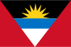 |
| Anguilla | AI |  |
| Albania | AL |  |
| Armenia | AM | 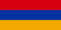 |
| Netherlands Antilles | AN |  |
| Angola | AO |  |
| Antarctica | AQ |  |
| Argentina | AR |  |
| American Samoa | AS |  |
| Austria | AT |  |
| Australia | AU |  |
| Aruba | AW |  |
| Åland Islands | AX | 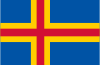 |
| Azerbaijan | AZ |  |
| Bosnia and Herzegovina | BA |  |
| Barbados | BB |  |
| Bangladesh | BD |  |
| Belgium | BE |  |
| Burkina Faso | BF | 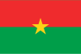 |
| Bulgaria | BG |  |
| Bahrain | BH |  |
| Burundi | BI |  |
| Benin | BJ | 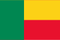 |
| Saint Barthélemy | BL |  |
| Bermuda | BM |  |
| Brunei Darussalam | BN |  |
| Bolivia, Plurinational State of | BO |  |
| Caribbean Netherlands | BQ |  |
| Brazil | BR | 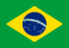 |
| Bahamas | BS |  |
| Bhutan | BT |  |
| Bouvet Island | BV |  |
| Botswana | BW |  |
| Belarus | BY |  |
| Belize | BZ |  |
| Canada | CA |  |
| Cocos (Keeling) Islands | CC |  |
| Congo, the Democratic Republic of the | CD |  |
| Central African Republic | CF | 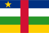 |
| Congo | CG |  |
| Switzerland | CH |  |
| Côte d’Ivoire | CI |  |
| Cook Islands | CK |  |
| Chile | CL |  |
| Cameroon | CM |  |
| China | CN |  |
| Colombia | CO |  |
| Costa Rica | CR |  |
| Cuba | CU |  |
| Cape Verde | CV |  |
| Curaçao | CW |  |
| Christmas Island | CX |  |
| Cyprus | CY |  |
| Czech Republic | CZ |  |
| Germany | DE |  |
| Djibouti | DJ |  |
| Denmark | DK |  |
| Dominica | DM | 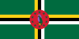 |
| Dominican Republic | DO |  |
| Algeria | DZ | 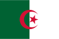 |
| Ecuador | EC |  |
| Estonia | EE |  |
| Egypt | EG |  |
| Western Sahara | EH |  |
| Eritrea | ER |  |
| Spain | ES |  |
| Ethiopia | ET |  |
| Europe | EU |  |
| Finland | FI |  |
| Fiji | FJ |  |
| Falkland Islands (Malvinas) | FK |  |
| Micronesia, Federated States of | FM |  |
| Faroe Islands | FO |  |
| France | FR |  |
| Gabon | GA |  |
| England | GB-ENG |  |
| Northern Ireland | GB-NIR |  |
| Scotland | GB-SCT |  |
| Wales | GB-WLS |  |
| United Kingdom | GB |  |
| Grenada | GD | 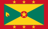 |
| Georgia | GE |  |
| French Guiana | GF | 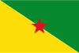 |
| Guernsey | GG |  |
| Ghana | GH |  |
| Gibraltar | GI |  |
| Greenland | GL |  |
| Gambia | GM |  |
| Guinea | GN |  |
| Guadeloupe | GP |  |
| Equatorial Guinea | GQ |  |
| Greece | GR |  |
| South Georgia and the South Sandwich Islands | GS |  |
| Guatemala | GT |  |
| Guam | GU |  |
| Guinea-Bissau | GW |  |
| Guyana | GY |  |
| Hong Kong | HK |  |
| Heard Island and McDonald Islands | HM |  |
| Honduras | HN |  |
| Croatia | HR |  |
| Haiti | HT |  |
| Hungary | HU |  |
| Indonesia | ID |  |
| Ireland | IE |  |
| Israel | IL |  |
| Isle of Man | IM |  |
| India | IN |  |
| British Indian Ocean Territory | IO |  |
| Iraq | IQ |  |
| Iran, Islamic Republic of | IR |  |
| Iceland | IS |  |
| Italy | IT |  |
| Jersey | JE |  |
| Jamaica | JM |  |
| Jordan | JO |  |
| Japan | JP |  |
| Kenya | KE |  |
| Kyrgyzstan | KG |  |
| Cambodia | KH |  |
| Kiribati | KI |  |
| Comoros | KM |  |
| Saint Kitts and Nevis | KN |  |
| Korea, Democratic People's Republic of | KP |  |
| Korea, Republic of | KR |  |
| Kuwait | KW |  |
| Cayman Islands | KY |  |
| Kazakhstan | KZ |  |
| Lao People's Democratic Republic | LA |  |
| Lebanon | LB |  |
| Saint Lucia | LC |  |
| Liechtenstein | LI |  |
| Sri Lanka | LK |  |
| Liberia | LR |  |
| Lesotho | LS |  |
| Lithuania | LT |  |
| Luxembourg | LU |  |
| Latvia | LV |  |
| Libya | LY |  |
| Morocco | MA | 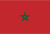 |
| Monaco | MC |  |
| Moldova, Republic of | MD |  |
| Montenegro | ME |  |
| Saint Martin | MF |  |
| Madagascar | MG |  |
| Marshall Islands | MH |  |
| Macedonia, the former Yugoslav Republic of | MK |  |
| Mali | ML |  |
| Myanmar | MM |  |
| Mongolia | MN |  |
| Macao | MO |  |
| Northern Mariana Islands | MP |  |
| Martinique | MQ |  |
| Mauritania | MR | 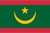 |
| Montserrat | MS |  |
| Malta | MT |  |
| Mauritius | MU |  |
| Maldives | MV |  |
| Malawi | MW |  |
| Mexico | MX |  |
| Malaysia | MY |  |
| Mozambique | MZ | 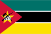 |
| Namibia | NA |  |
| New Caledonia | NC |  |
| Niger | NE |  |
| Norfolk Island | NF |  |
| Nigeria | NG |  |
| Nicaragua | NI |  |
| Netherlands | NL |  |
| Norway | NO |  |
| Nepal | NP |  |
| Nauru | NR |  |
| Niue | NU |  |
| New Zealand | NZ |  |
| Oman | OM |  |
| Panama | PA |  |
| Peru | PE |  |
| French Polynesia | PF |  |
| Papua New Guinea | PG |  |
| Philippines | PH |  |
| Pakistan | PK |  |
| Poland | PL |  |
| Saint Pierre and Miquelon | PM |  |
| Pitcairn | PN |  |
| Puerto Rico | PR |  |
| Palestine | PS |  |
| Portugal | PT |  |
| Palau | PW |  |
| Paraguay | PY |  |
| Qatar | QA |  |
| Réunion | RE |  |
| Romania | RO |  |
| Serbia | RS |  |
| Russian Federation | RU |  |
| Rwanda | RW |  |
| Saudi Arabia | SA |  |
| Solomon Islands | SB |  |
| Seychelles | SC |  |
| Sudan | SD |  |
| Sweden | SE |  |
| Singapore | SG |  |
| Saint Helena, Ascension and Tristan da Cunha | SH |  |
| Slovenia | SI |  |
| Svalbard and Jan Mayen Islands | SJ |  |
| Slovakia | SK |  |
| Sierra Leone | SL |  |
| San Marino | SM | 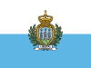 |
| Senegal | SN | 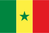 |
| Somalia | SO |  |
| Suriname | SR | 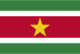 |
| South Sudan | SS |  |
| Sao Tome and Principe | ST |  |
| El Salvador | SV |  |
| Sint Maarten (Dutch part) | SX |  |
| Syrian Arab Republic | SY |  |
| Swaziland | SZ |  |
| Turks and Caicos Islands | TC |  |
| Chad | TD |  |
| French Southern Territories | TF |  |
| Togo | TG |  |
| Thailand | TH |  |
| Tajikistan | TJ |  |
| Tokelau | TK |  |
| Timor-Leste | TL |  |
| Turkmenistan | TM |  |
| Tunisia | TN |  |
| Tonga | TO |  |
| Turkey | TR |  |
| Trinidad and Tobago | TT |  |
| Tuvalu | TV |  |
| Taiwan | TW |  |
| Tanzania, United Republic of | TZ |  |
| Ukraine | UA | 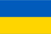 |
| Uganda | UG |  |
| US Minor Outlying Islands | UM |  |
| United States | US |  |
| Uruguay | UY |  |
| Uzbekistan | UZ |  |
| Holy See (Vatican City State) | VA |  |
| Saint Vincent and the Grenadines | VC |  |
| Venezuela, Bolivarian Republic of | VE |  |
| Virgin Islands, British | VG |  |
| Virgin Islands, U.S. | VI |  |
| Viet Nam | VN |  |
| Vanuatu | VU |  |
| Wallis and Futuna Islands | WF |  |
| Kosovo | XK |  |
| Samoa | WS |  |
| Yemen | YE |  |
| Mayotte | YT |  |
| South Africa | ZA |  |
| Zambia | ZM |  |
| Zimbabwe | ZW |  |

</p>
</details>

### Club Badges
<details><summary>Collapsible Section</summary>
<p>

#### Any help filling the cells with club names would be greatly appreciated. Raise a pull request with your changes if you'd like to help.

| Club Name | Club Code | Badge |
| :-------: | :-------: | :----: |
| Arsenal | 1 |  |
| | 2 |  |
| | 3 |  |
| | 4 |  |
| Chelsea | 5 |  |
| | 7 |  |
| | 8 |  |
| Liverpool | 9 |  |
| Manchester City | 10 |  |
| Manchester United | 11 |  |
| | 12 |  |
| Newcastle United | 13 |  |
| | 14 |  |
| | 15 |  |
| | 17 |  |
| | 18 |  |
| | 19 |  |
| FC Bayern Munich | 21 |  |
| Borussia Dortmund | 22 |  |
| | 23 |  |
| | 25 |  |
| | 27 |  |
| | 28 |  |
| | 29 |  |
| | 31 |  |
| | 32 |  |
| | 33 |  |
| | 34 |  |
| | 36 |  |
| | 38 |  |
| | 39 |  |
| Inter Milan | 44 |  |
| Juventus | 45 |  |
| | 46 |  |
| | 47 |  |
| Napoli | 48 |  |
| | 50 |  |
| | 52 |  |
| | 54 |  |
| | 55 |  |
| | 57 |  |
| | 59 |  |
| | 62 |  |
| | 64 |  |
| | 65 |  |
| | 66 |  |
| | 68 |  |
| | 69 |  |
| | 70 |  |
| | 71 |  |
| | 72 |  |
| Paris Saint-Germain | 73 |  |
| | 74 |  |
| | 76 |  |
| | 77 |  |
| | 78 |  |
| | 80 |  |
| | 81 |  |
| | 82 |  |
| | 83 |  |
| | 86 |  |
| | 88 |  |
| | 89 |  |
| | 91 |  |
| | 92 |  |
| | 94 |  |
| | 95 |  |
| | 97 |  |
| | 106 |  |
| | 109 |  |
| | 110 |  |
| | 121 |  |
| | 127 |  |
| | 142 |  |
| | 143 |  |
| | 144 |  |
| | 149 |  |
| | 159 |  |
| | 160 |  |
| | 162 |  |
| | 165 |  |
| | 166 |  |
| | 167 |  |
| | 169 |  |
| | 171 |  |
| | 172 |  |
| | 175 |  |
| | 180 |  |
| | 184 |  |
| | 189 |  |
| | 190 |  |
| | 191 |  |
| | 192 |  |
| | 199 |  |
| | 200 |  |
| | 205 |  |
| | 206 |  |
| | 209 |  |
| | 210 |  |
| | 211 |  |
| | 212 |  |
| | 217 |  |
| | 219 |  |
| | 224 |  |
| | 226 |  |
| | 229 |  |
| | 230 |  |
| | 231 |  |
| | 232 |  |
| | 234 |  |
| | 236 |  |
| | 237 |  |
| Atlético Madrid | 240 |  |
| Barcelona | 241 |  |
| | 242 |  |
| Real Madrid | 243 |  |
| | 244 |  |
| | 245 |  |
| | 246 |  |
| | 247 |  |
| | 252 |  |
| | 254 |  |
| | 256 |  |
| | 260 |  |
| | 266 |  |
| | 267 |  |
| | 269 |  |
| | 271 |  |
| | 272 |  |
| | 278 |  |
| | 280 |  |
| | 294 |  |
| | 298 |  |
| | 299 |  |
| | 305 |  |
| | 306 |  |
| | 315 |  |
| | 319 |  |
| | 320 |  |
| | 322 |  |
| | 325 |  |
| | 326 |  |
| | 327 |  |
| | 346 |  |
| | 347 |  |
| | 357 |  |
| | 361 |  |
| | 378 |  |
| | 379 |  |
| | 393 |  |
| | 417 |  |
| | 418 |  |
| | 420 |  |
| | 422 |  |
| | 423 |  |
| | 433 |  |
| | 435 |  |
| | 436 |  |
| | 445 |  |
| | 448 |  |
| | 449 |  |
| | 450 |  |
| | 452 |  |
| | 453 |  |
| | 457 |  |
| | 459 |  |
| | 461 |  |
| | 462 |  |
| | 463 |  |
| | 467 |  |
| | 468 |  |
| | 469 |  |
| | 472 |  |
| | 477 |  |
| | 479 |  |
| | 480 |  |
| | 481 |  |
| | 483 |  |
| | 485 |  |
| | 487 |  |
| | 492 |  |
| | 503 |  |
| | 506 |  |
| | 518 |  |
| | 531 |  |
| | 543 |  |
| | 550 |  |
| | 561 |  |
| | 563 |  |
| | 573 |  |
| | 576 |  |
| | 605 |  |
| | 607 |  |
| | 614 |  |
| | 621 |  |
| | 634 |  |
| | 635 |  |
| | 650 |  |
| | 665 |  |
| | 666 |  |
| | 670 |  |
| | 673 |  |
| | 674 |  |
| | 680 |  |
| | 682 |  |
| | 687 |  |
| | 688 |  |
| | 689 |  |
| | 691 |  |
| | 693 |  |
| | 694 |  |
| | 695 |  |
| | 696 |  |
| | 697 |  |
| | 698 |  |
| | 700 |  |
| | 702 |  |
| | 703 |  |
| | 705 |  |
| | 708 |  |
| | 710 |  |
| | 711 |  |
| | 741 |  |
| | 742 |  |
| | 744 |  |
| | 749 |  |
| | 753 |  |
| | 819 |  |
| | 820 |  |
| | 822 |  |
| | 837 |  |
| | 838 |  |
| | 873 |  |
| | 894 |  |
| | 896 |  |
| | 897 |  |
| | 898 |  |
| | 900 |  |
| | 917 |  |
| | 918 |  |
| | 919 |  |
| | 920 |  |
| | 922 |  |
| | 982 |  |
| | 983 |  |
| | 1013 |  |
| | 1028 |  |
| | 1032 |  |
| | 1438 |  |
| | 1439 |  |
| | 1445 |  |
| | 1446 |  |
| | 1447 |  |
| | 1456 |  |
| | 1463 |  |
| | 1473 |  |
| | 1474 |  |
| | 1475 |  |
| | 1477 |  |
| | 1478 |  |
| | 1480 |  |
| | 1516 |  |
| | 1524 |  |
| | 1530 |  |
| | 1569 |  |
| | 1596 |  |
| | 1715 |  |
| | 1738 |  |
| | 1746 |  |
| | 1750 |  |
| | 1757 |  |
| | 1785 |  |
| | 1786 |  |
| | 1788 |  |
| | 1790 |  |
| | 1792 |  |
| | 1793 |  |
| | 1794 |  |
| | 1795 |  |
| | 1796 |  |
| | 1797 |  |
| | 1798 |  |
| | 1799 |  |
| | 1800 |  |
| | 1801 |  |
| | 1802 |  |
| | 1803 |  |
| | 1804 |  |
| | 1806 |  |
| | 1807 |  |
| | 1808 |  |
| | 1809 |  |
| | 1813 |  |
| | 1815 |  |
| | 1816 |  |
| | 1819 |  |
| | 1823 |  |
| | 1824 |  |
| | 1825 |  |
| | 1831 |  |
| | 1832 |  |
| | 1837 |  |
| | 1842 |  |
| | 1843 |  |
| | 1844 |  |
| | 1847 |  |
| | 1853 |  |
| | 1854 |  |
| | 1860 |  |
| | 1861 |  |
| | 1867 |  |
| | 1871 |  |
| | 1873 |  |
| | 1876 |  |
| | 1877 |  |
| | 1878 |  |
| | 1879 |  |
| | 1880 |  |
| | 1881 |  |
| | 1882 |  |
| | 1884 |  |
| | 1887 |  |
| | 1889 |  |
| | 1891 |  |
| | 1893 |  |
| | 1896 |  |
| | 1898 |  |
| | 1900 |  |
| | 1903 |  |
| | 1904 |  |
| | 1906 |  |
| | 1907 |  |
| | 1909 |  |
| | 1913 |  |
| | 1914 |  |
| | 1915 |  |
| | 1917 |  |
| | 1919 |  |
| | 1920 |  |
| | 1923 |  |
| | 1925 |  |
| | 1926 |  |
| | 1928 |  |
| | 1929 |  |
| | 1930 |  |
| | 1932 |  |
| | 1933 |  |
| | 1934 |  |
| | 1935 |  |
| | 1936 |  |
| | 1937 |  |
| | 1938 |  |
| | 1939 |  |
| | 1940 |  |
| | 1943 |  |
| | 1944 |  |
| | 1945 |  |
| | 1949 |  |
| | 1951 |  |
| | 1952 |  |
| | 1954 |  |
| | 1955 |  |
| | 1959 |  |
| | 1960 |  |
| | 1961 |  |
| | 1962 |  |
| | 1968 |  |
| | 1970 |  |
| | 1971 |  |
| | 2007 |  |
| | 2013 |  |
| | 2017 |  |
| | 2045 |  |
| | 2055 |  |
| | 2056 |  |
| | 10019 |  |
| | 10029 |  |
| | 10030 |  |
| | 10031 |  |
| | 10032 |  |
| | 15005 |  |
| | 15009 |  |
| | 15015 |  |
| | 15019 |  |
| | 15029 |  |
| | 15048 |  |
| | 100081 |  |
| | 100325 |  |
| | 100409 |  |
| | 100628 |  |
| | 100634 |  |
| | 100651 |  |
| | 100765 |  |
| | 100767 |  |
| | 100804 |  |
| | 100805 |  |
| | 100831 |  |
| | 100888 |  |
| | 101007 |  |
| | 101014 |  |
| | 101020 |  |
| | 101026 |  |
| | 101033 |  |
| | 101037 |  |
| | 101041 |  |
| | 101047 |  |
| | 101059 |  |
| | 101083 |  |
| | 101084 |  |
| | 101085 |  |
| | 101088 |  |
| | 101097 |  |
| | 101099 |  |
| | 101100 |  |
| | 101101 |  |
| | 101102 |  |
| | 101103 |  |
| | 101104 |  |
| | 101105 |  |
| | 101106 |  |
| | 101112 |  |
| | 101114 |  |
| | 101121 |  |
| | 101144 |  |
| | 101145 |  |
| | 101146 |  |
| | 101147 |  |
| | 101148 |  |
| | 101149 |  |
| | 101150 |  |
| | 101151 |  |
| | 110062 |  |
| | 110066 |  |
| | 110093 |  |
| | 110144 |  |
| | 110145 |  |
| | 110147 |  |
| | 110150 |  |
| | 110152 |  |
| | 110169 |  |
| | 110178 |  |
| | 110197 |  |
| | 110313 |  |
| | 110316 |  |
| | 110329 |  |
| | 110373 |  |
| | 110374 |  |
| | 110395 |  |
| | 110396 |  |
| | 110404 |  |
| | 110406 |  |
| | 110456 |  |
| | 110468 |  |
| | 110482 |  |
| | 110500 |  |
| | 110502 |  |
| | 110556 |  |
| | 110569 |  |
| | 110580 |  |
| | 110581 |  |
| | 110588 |  |
| | 110591 |  |
| | 110592 |  |
| | 110597 |  |
| | 110636 |  |
| | 110700 |  |
| | 110734 |  |
| | 110741 |  |
| | 110745 |  |
| | 110746 |  |
| | 110747 |  |
| | 110749 |  |
| | 110765 |  |
| | 110770 |  |
| | 110781 |  |
| | 110827 |  |
| | 110831 |  |
| | 110832 |  |
| | 110839 |  |
| | 110854 |  |
| | 110890 |  |
| | 110911 |  |
| | 110912 |  |
| | 110913 |  |
| | 110929 |  |
| | 110930 |  |
| | 110955 |  |
| | 110975 |  |
| | 110977 |  |
| | 110980 |  |
| | 111019 |  |
| | 111022 |  |
| | 111035 |  |
| | 111065 |  |
| | 111082 |  |
| | 111083 |  |
| | 111086 |  |
| | 111089 |  |
| | 111091 |  |
| | 111092 |  |
| | 111138 |  |
| | 111139 |  |
| | 111140 |  |
| | 111144 |  |
| | 111235 |  |
| | 111239 |  |
| | 111273 |  |
| | 111285 |  |
| | 111327 |  |
| | 111328 |  |
| | 111339 |  |
| | 111340 |  |
| | 111379 |  |
| | 111393 |  |
| | 111395 |  |
| | 111396 |  |
| | 111397 |  |
| | 111398 |  |
| | 111399 |  |
| | 111400 |  |
| | 111434 |  |
| | 111560 |  |
| | 111575 |  |
| | 111588 |  |
| | 111651 |  |
| | 111657 |  |
| | 111660 |  |
| | 111674 |  |
| | 111678 |  |
| | 111705 |  |
| | 111706 |  |
| | 111707 |  |
| | 111708 |  |
| | 111710 |  |
| | 111711 |  |
| | 111713 |  |
| | 111714 |  |
| | 111715 |  |
| | 111716 |  |
| | 111722 |  |
| | 111723 |  |
| | 111724 |  |
| | 111730 |  |
| | 111766 |  |
| | 111768 |  |
| | 111769 |  |
| | 111774 |  |
| | 111779 |  |
| | 111817 |  |
| | 111821 |  |
| | 111822 |  |
| | 111839 |  |
| | 111928 |  |
| | 111974 |  |
| | 111993 |  |
| | 112019 |  |
| | 112026 |  |
| | 112075 |  |
| | 112092 |  |
| | 112093 |  |
| | 112096 |  |
| | 112115 |  |
| | 112116 |  |
| | 112134 |  |
| | 112139 |  |
| | 112162 |  |
| | 112165 |  |
| | 112168 |  |
| | 112172 |  |
| | 112199 |  |
| | 112200 |  |
| | 112224 |  |
| | 112254 |  |
| | 112259 |  |
| | 112260 |  |
| | 112276 |  |
| | 112378 |  |
| | 112387 |  |
| | 112389 |  |
| | 112390 |  |
| | 112391 |  |
| | 112392 |  |
| | 112393 |  |
| | 112408 |  |
| | 112409 |  |
| | 112425 |  |
| | 112427 |  |
| | 112429 |  |
| | 112444 |  |
| | 112448 |  |
| | 112505 |  |
| | 112516 |  |
| | 112523 |  |
| | 112526 |  |
| | 112527 |  |
| | 112528 |  |
| | 112531 |  |
| | 112533 |  |
| | 112534 |  |
| | 112535 |  |
| | 112537 |  |
| | 112540 |  |
| | 112578 |  |
| | 112579 |  |
| | 112584 |  |
| | 112606 |  |
| | 112655 |  |
| | 112658 |  |
| | 112668 |  |
| | 112670 |  |
| | 112709 |  |
| | 112791 |  |
| | 112828 |  |
| | 112836 |  |
| | 112885 |  |
| | 112903 |  |
| | 112970 |  |
| | 112977 |  |
| | 112978 |  |
| | 112983 |  |
| | 112990 |  |
| | 112992 |  |
| | 112996 |  |
| | 113057 |  |
| | 113142 |  |
| | 113157 |  |
| | 113160 |  |
| | 113161 |  |
| | 113173 |  |
| | 113219 |  |
| | 113222 |  |
| | 113259 |  |
| | 113458 |  |
| | 113459 |  |
| | 113876 |  |
| | 113948 |  |


</p>
</details>
